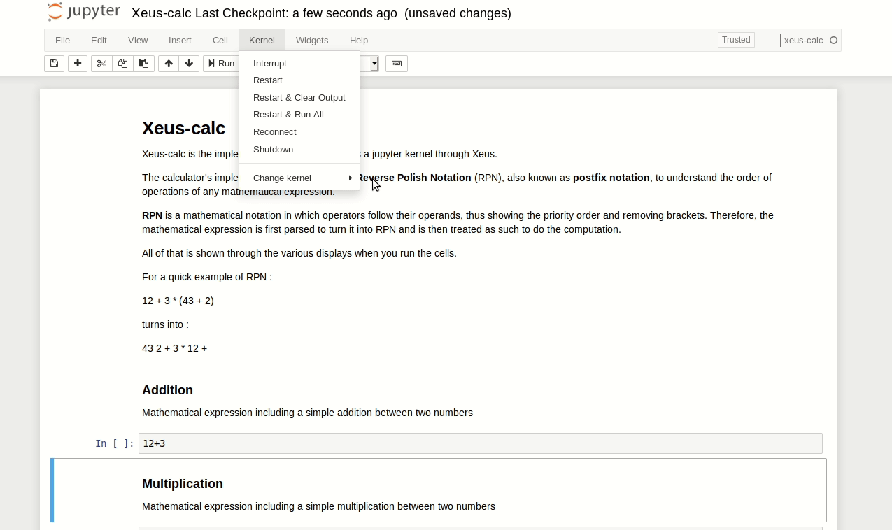

# xeus-calc

[](https://dev.azure.com/jupyter-xeus/jupyter-xeus/_build/latest?definitionId=10&branchName=master)
[](https://ci.appveyor.com/project/jupyter-xeus/xeus-calc)
[](https://mybinder.org/v2/gh/jupyter-xeus/xeus-calc/master?filepath=notebooks/Xeus-calc.ipynb)

Calculator as a Jupyter Kernel implemented with Xeus

## Usage

Launch the Jupyter notebook with `jupyter notebook` or Jupyter lab with `jupyter lab` and launch a new notebook by selecting the **xeus-calc** kernel.

**Code execution**:



## Installation

To ensure that the installation works, it is preferable to install `xeus` in a fresh mamba/conda environment. 

```bash
mamba create -n xeus-calc-env -c conda-forge -f environment-dev.yml
```

Once you have installed ` xeus ` ,the  ` xeus-calc ` project is quite easy to install, you have to clone the repository, and run the following command lines :

```bash
mkdir build
cd build
cmake -D CMAKE_INSTALL_PREFIX=$CONDA_PREFIX ..
make
make install
```

## Contributing

See [CONTRIBUTING.md](./CONTRIBUTING.md) to know how to contribute and set up a development environment.

## License

We use a shared copyright model that enables all contributors to maintain the
copyright on their contributions.

This software is licensed under the BSD-3-Clause license. See the [LICENSE](LICENSE) file for details.
